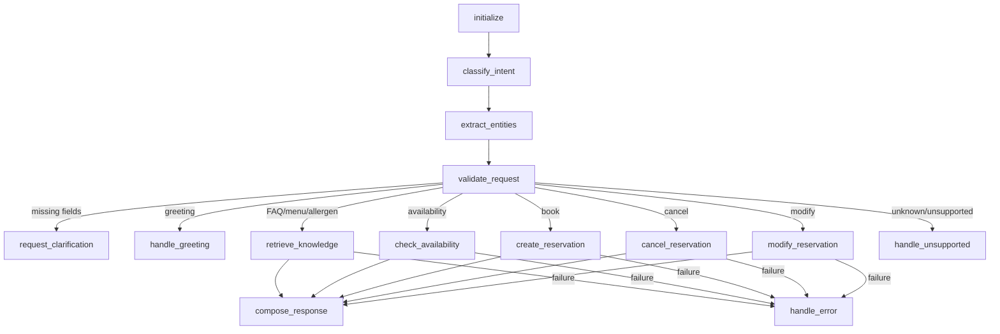

# Stage 5 Conversation Graph

## Purpose and scope

Stage 5 adds a stateless, deterministic LangGraph workflow for one restaurant conversation turn. It classifies a message, extracts only explicit entities, validates required fields, routes to exactly one bounded operation, and returns a concise structured response. It does not add voice, streaming, memory, autonomous tool use, or LLM-generated final answers.

## Graph



The compiled graph is owned by `ConversationService`. Production dependencies are request-scoped because the SQLAlchemy session is request-scoped; within that lifecycle the graph compiles once and processes one self-contained turn.

## State

`ConversationState` is a strongly typed, JSON-serializable `TypedDict`. It carries the input message and language, classified intent/confidence, normalized entities, missing fields, routing action, response data, citations, availability/reservation results, safe error data, and optional trace. Services, SDK clients, sessions, and credentials are never stored in graph state.

Normalized dates use `YYYY-MM-DD`, times use 24-hour `HH:MM`, party size is an integer, and phone normalization is conservative. The rule extractor supports ISO dates, deterministic `tomorrow` based on `RESTAURANT_TIMEZONE`, 7 PM/19:00 forms, party phrases, confirmation codes, and explicitly labelled names and phone numbers. It never invents missing values.

## Intents and validation

| Intent | Required data | Operation |
|---|---|---|
| `greeting` | none | static greeting |
| `knowledge_query` | none | `RagService.retrieve_context()` |
| `check_availability` | date, time, party size | `ReservationService.check_availability()` |
| `create_reservation` | name, phone, date, time, party size | `ReservationService.create()` |
| `cancel_reservation` | reservation ID or confirmation code | lookup then `ReservationService.cancel()` |
| `modify_reservation` | ID/code and at least one requested date/time/party change | lookup then `ReservationService.update()` |
| `unsupported` / `unknown` | none | bounded capability response |

Clarification asks for only the first missing field and returns a machine-readable `next_action`. A reservation confirmation is composed only after the transactional reservation service returns successfully.

## Dependency boundaries

- `IntentClassifier` and `EntityExtractor` are protocols. Rules are the default and work offline.
- `CONVERSATION_INTENT_PROVIDER=google` enables optional Google classification/extraction when both `GOOGLE_API_KEY` and `GOOGLE_CHAT_MODEL` are configured. Failures fall back to rules. API keys are never logged.
- `KnowledgeGateway` delegates restaurant-document questions to Stage 4 RAG. No evidence produces no citations and a safe answer.
- `ReservationGateway` delegates live availability and all reservation mutations to Stage 3. RAG is never queried for live availability.
- Tests inject fakes; no Internet or live provider is required.

## API

`POST /api/v1/conversation/message`

```json
{
  "message": "Book a table for four on 2030-08-01 at 7 PM, my name is Asha and phone is 9876543210",
  "language": "en",
  "debug": false
}
```

The response includes `intent`, `response_type`, concise `response_text`, `next_action`, extracted `entities`, citations, and optional availability/reservation objects. `trace` is `null` unless `debug=true`; debug trace contains node names and completion status only, never message content, phone numbers, credentials, headers, or SDK payloads.

## Error and latency behavior

Expected domain exceptions become safe response errors. Unexpected reservation failures use generic messages. RAG failure degrades to a no-evidence answer. Classification and extraction are local by default, so the main latency is one RAG retrieval or one database operation. The graph has no loops and dispatches at most one external business operation per request.

## Known limitations and Stage 6 boundary

This stage is English-first rule extraction with limited Hindi/Gujarati keyword intent support. Each request is self-contained: follow-up memory, confirmation turns, multilingual LLM response generation, tool-calling policy, voice I/O, WebSockets, Twilio, interruption, and handoff execution remain future work. Stage 6 may add an LLM response/tool layer without weakening the deterministic business-operation boundaries established here.
