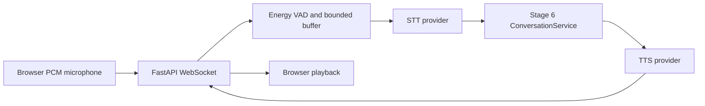
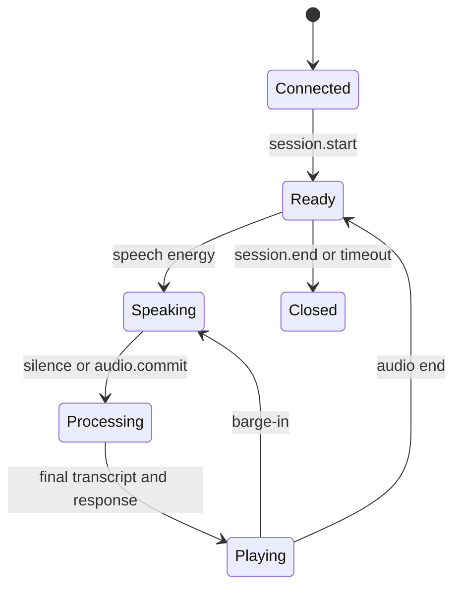
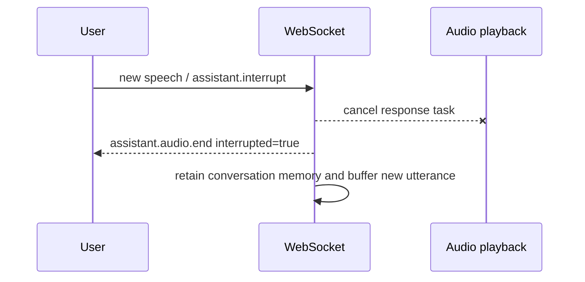

# Stage 7 — Real-Time Voice Pipeline

## Architecture

Voice is an input/output transport. It validates and segments audio, converts only final speech to text, calls the existing Stage 6 `ConversationService`, and speaks the verified response. STT and TTS cannot access reservation, RAG, database, or tool services.



The endpoint is `WS /api/v1/voice/ws`. Protocol version `1.0` separates JSON control events from binary audio. A `session.start` handshake must negotiate mono raw signed 16-bit little-endian PCM at 16 kHz. Output is mono raw PCM at 24 kHz. WebM is represented as an adapter boundary but is rejected by the built-in handler because no mandatory FFmpeg dependency is installed.

## Session lifecycle



Each runtime has bounded audio, one processing lock, and one playback task. The process-local manager protects its registry with `asyncio.Lock`, enforces connection limits, and clears buffers/tasks on disconnect. Disconnect does not delete Stage 6 memory; `conversation.reset` does.

## VAD and turn processing

The energy VAD computes PCM RMS using the standard library. Pre-speech frames are retained, minimum speech prevents noise commits, trailing silence ends an utterance, and maximum bytes cap duration. Explicit `audio.commit` is supported. Partial transcript events are part of the protocol, but completed-utterance Google recognition does not claim partials. Only final transcripts enter Stage 6.

Language priority is explicit session language, provider detection when no explicit value exists, then `VOICE_DEFAULT_LANGUAGE`. Supported values are `en-IN`, `hi-IN`, and `gu-IN`; Stage 6 receives their base codes.

## Providers

Fake STT consumes a deterministic transcript queue without inspecting audio. Fake TTS emits valid deterministic raw PCM. They are defaults and need no network, credentials, microphone, or audio hardware.

Optional Google Cloud adapters lazily import official `google-cloud-speech` and `google-cloud-texttospeech` clients, initialize clients only on use, and offload synchronous calls with `asyncio.to_thread`. Install them with:

```bash
pip install -e '.[voice-google]'
```

Then configure `VOICE_STT_PROVIDER=google_cloud`, `VOICE_TTS_PROVIDER=google_cloud`, and optionally `GOOGLE_CLOUD_PROJECT`. Google libraries normally use Application Default Credentials. Never place credential JSON in the repository or send credentials to the browser.

## Confirmation and interruption safety

The voice coordinator calls Stage 6 with the stable conversation ID and metadata `{channel: voice, language, voice_session_id}`. It does not classify, extract entities, retrieve documents, or dispatch tools. Therefore mutation confirmation and database-success-before-confirmation rules remain authoritative.



Completed database operations are never rolled back by interruption. A response generation ID prevents a new turn from adopting old playback state. The handler deterministically returns `session_busy` if a second utterance is committed while processing.

## Errors, timeouts, and security

Stable safe events cover malformed JSON, unsupported protocol/audio/language, pre-handshake binary data, limits, empty transcripts, provider timeouts, and internal failures. TTS failure still delivers assistant text; STT failure never calls Stage 6. Idle sessions close normally. Frame, JSON, transcript, utterance, session, pending-frame, and active-session limits are configurable. Production origins must be explicit. Raw audio is neither logged nor persisted; provider payloads and credentials never enter events.

`GET /api/v1/voice/status` reports enabled/provider/dependency/session information without credentials.

## Browser demo and testing

Serve `examples/voice_demo` from a local HTTP server or copy it behind the backend origin. It uses browser microphone APIs, clamps Float32 samples, performs simple nearest-neighbor resampling to 16 kHz, sends PCM, and plays 24 kHz response chunks. This dependency-free resampling is a development demonstration, not production-grade audio processing.

Run offline verification:

```bash
python scripts/test_voice_websocket.py
```

Limitations: process-local sessions, completed-utterance recognition, no persistent distributed queue, basic energy VAD, simple browser resampling, and no telephony. Stage 8 will introduce telephony as a separate transport without moving business logic into it.
