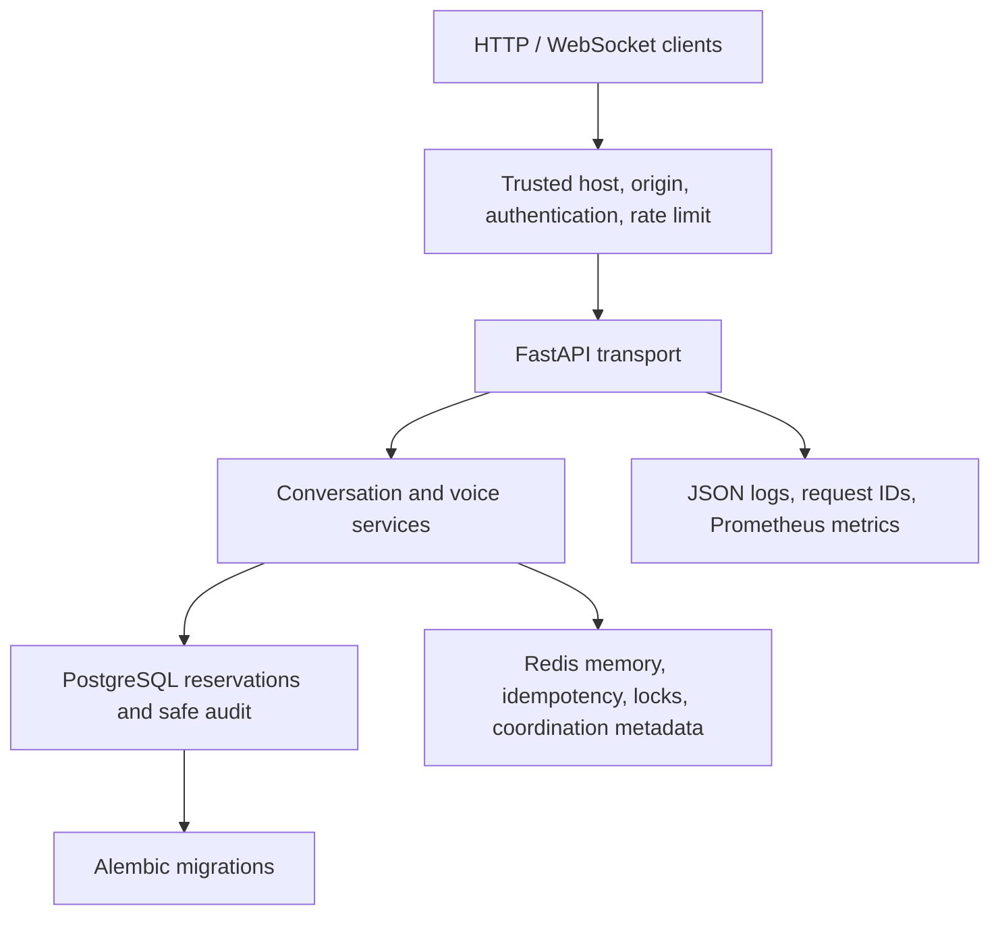
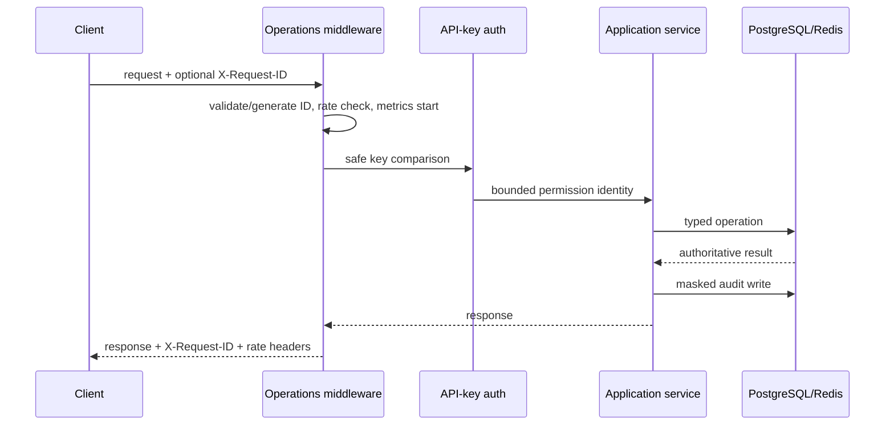
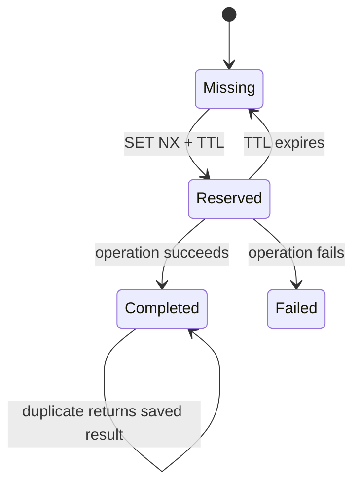
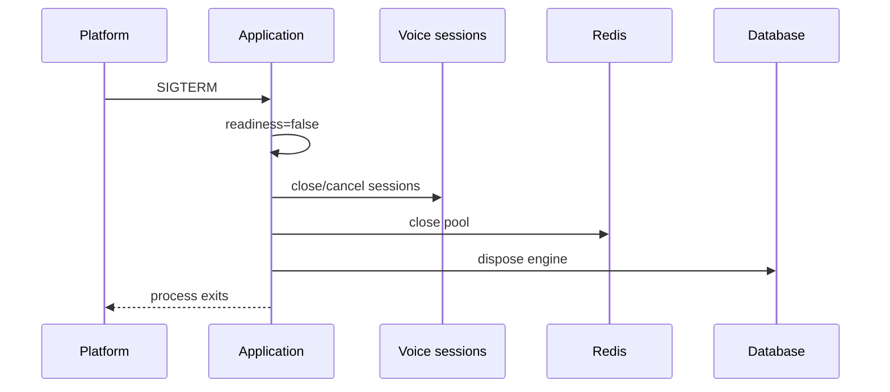
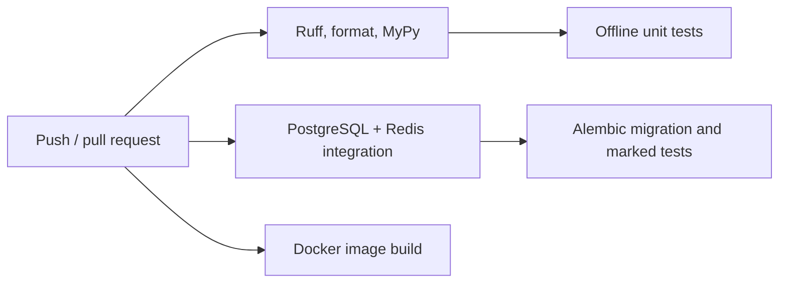

# Stage 8A — Production Readiness and Deployment Foundation

## Architecture

Stage 8A keeps the modular monolith and places infrastructure behind protocols. Conversation, reservation, RAG, and voice business behavior do not issue Redis commands, authenticate keys, format metrics, or write audit rows directly.



Development and tests default to in-memory coordination and fake voice providers. Production validation prevents silent use of unsafe fallbacks.

## Request lifecycle



## Redis adapters

The official async `redis` client is created lazily by `RedisClientManager`, which owns its bounded pool, safe key namespace, health check, and shutdown. Keys follow `prefix:environment:resource:identifier`; URLs and credentials are never logged.

`RedisConversationMemory` implements the existing Stage 6 protocol with validated JSON, schema version `1`, TTL refresh, history truncation, corruption deletion, independent model copies, and ownership-safe locks. It stores no clients, raw documents, provider payloads, credentials, or audio.

Idempotency implements `missing → reserved → completed` and optional `failed`. Redis reservation uses atomic `SET NX`; completed results can be replayed across service instances. Keys are SHA-256 hashes of conversation, allowlisted tool, and canonical validated arguments.



Redis distributed locks use unique tokens, expiration, bounded acquisition, and compare-and-delete Lua release. Redis voice coordination stores only safe metadata; sockets and audio buffers remain local. Multi-node live WebSocket handoff is not supported.

## PostgreSQL audit history

Migration `20260721_0002` adds `conversation_sessions`, `conversation_turns`, and `tool_audit_events`. Turn audit is synchronously attempted after a completed Stage 6 turn. It stores masked user text, assistant response, bounded intent/response/provider fields, safe citation identifiers, confirmation/tool outcome, and latency. A formatting or audit failure is rolled back and logged but does not reverse an already committed reservation.

Raw audio, complete phone numbers, API keys, prompts, hidden reasoning, provider bodies, and database exceptions are excluded. Transcript storage can be disabled.

## Authentication and permissions

API keys come only from environment-backed `SecretStr` lists. Validation checks all candidates with constant-time comparison and exposes only a truncated SHA-256 fingerprint. Roles are `public`, `client`, `admin`, and `internal`. Central permissions cover text messages, voice sessions, reset, debug state, metrics, detailed health, and audit access. API-key auth is the implemented mechanism; JWT remains an extension boundary.

WebSockets prefer `X-API-Key`. Query keys require an explicit development-only flag and are rejected by production validation. Unauthorized sockets close with policy code `1008` before audio processing.

## Rate limiting

The bounded algorithm is fixed-window counting. In-memory and atomic Redis implementations share one protocol. Identities use the API-key fingerprint or direct peer IP; forwarded headers are not trusted unless a future trusted-proxy adapter explicitly enables them. Text, voice connection, health, reset, and metrics scopes have separate limits. HTTP rejection returns `429`, safe error JSON, `Retry-After`, and limit headers.

## Logging, request IDs, and metrics

Incoming request IDs are accepted only when they match a 64-character safe allowlist; otherwise a UUID is generated. IDs live in a context variable, are returned in `X-Request-ID`, and enter structured logs. WebSocket connection IDs are independent from conversation IDs.

Production requires JSON logging. Central redaction masks phone-like strings and strips URL credentials/query strings. Client errors never receive tracebacks. Prometheus metrics cover bounded HTTP route/method/status labels, latency, active requests, conversation intent/provider/fallback, and voice open/close activity. IDs and user text are never labels. `/metrics` requires admin permission when authentication is enabled.

## Health and graceful lifecycle

- `/health/live`: process-only liveness, no external dependency.
- `/health`: safe existing summary.
- `/health/ready`: PostgreSQL plus required Redis and safe conversation/voice configuration status; `503` when required components fail.
- `/api/v1/health/database`: existing database-specific readiness.



Startup validates production configuration before readiness, optionally pings required Redis, then marks ready. Shutdown reverses readiness, closes sessions and Redis, and disposes SQLAlchemy.

## Deployment

`deploy/Dockerfile` is a Python 3.12 slim multi-stage build with cached dependencies, non-root runtime user, no development tools or `.env`, one Uvicorn worker, health check, and exec-based signal handling. `deploy/docker-compose.yml` supplies app, PostgreSQL 16, and Redis 7 with named volumes and health-gated startup. The included database password is explicitly development-only; replace all credentials outside local demonstration.

```bash
docker compose -f deploy/docker-compose.yml up --build
```

Startup waits for PostgreSQL, waits for Redis only when required, applies `alembic upgrade head`, and then starts Uvicorn. Migration failure stops startup. No destructive migrations run automatically.

## CI and load testing



CI requires no Google secrets and never deploys. Local commands:

```bash
pytest -m "not integration"
pytest -m integration
python scripts/verify_production_config.py
python scripts/test_production_stack.py
```

Install `.[load]` for Locust and WebSocket load helpers. `scripts/load_test_text.py` covers bounded text scenarios; `scripts/load_test_voice.py` sends dummy PCM without microphone hardware. Never use placeholder keys against a real environment.

## Production security checklist

- Configure distinct rotated client/admin keys and JSON logging.
- Use PostgreSQL, explicit trusted hosts/origins, TLS termination, and non-fake voice providers.
- Enable Redis whenever a selected backend is Redis; never silently fall back.
- Disable WebSocket query keys and debug mode.
- Keep raw-audio history disabled and define audit retention cleanup operationally.
- Restrict `/metrics` and detailed readiness to administrators.
- Replace Compose development credentials and keep `.env`/credential JSON outside images and Git.
- Back up PostgreSQL and Redis according to recovery objectives and rehearse Alembic recovery.

## Limitations and Stage 8B boundary

The application is still a modular monolith. WebSockets remain process-local and one worker is recommended. Redis offers visibility, memory, locks, and coarse coordination, not seamless live socket migration. Audit retention deletion, backup automation, secret-manager integration, distributed tracing, Kubernetes, Terraform, and multi-region recovery remain operational follow-ups. Stage 8B may add telephony as a transport adapter only; no Twilio, SIP, or phone-call code exists in Stage 8A.
